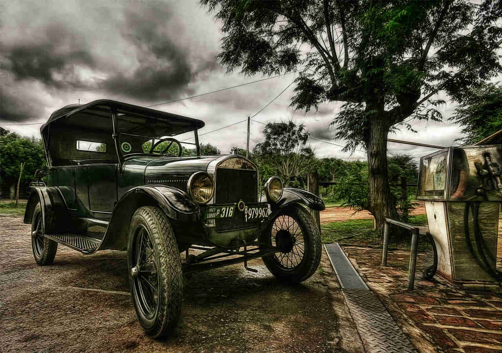

# finalproject

Objetivo: Entrenar un modelo capaz de deducir el color de un coche. 

El objetivo es parte de un proyecto más complejo que debería ser capaz de cotejar el modelo de un coche con su matrícula en una foto tomada por un radar de velocidad o un parking público. 
De esta manera el programa podría decir si el modelo y color corresponde con su matrícula, avisando de que la matrícula es falsa.

1.- El primer problema, como casi siempre, es conseguir un dataset que se ajuste lo máximo posible al proyecto que queremos realizar. En este caso habíamos elegido el famoso dataset 196 de coches de stanford, competición que sigue en curso, pero sus datos, a pesar de lo tremendamente extensos, no contenían la variable color que es la primera con la que queremos trabajar. 
Dataset https://ai.stanford.edu/~jkrause/cars/car_dataset.html?fbclid=IwAR2XibtbHU_dES8CXk5llA-CpwRm18Ntji1n72gcmLVkJLtZyk0zlTVYT_I

Tras mucha búsqueda, el dataset elegido es el que provee la Huazhong University of Science and Technology, Wuhan, Hubei, China. Aprovecho aquí para agradecer el trabajo y nombrar a los autores:
Vehicle Color Recognition on an Urban Road by Feature Context. Pan chen, Xiang bai and Wenyu Liu. Intelligent Transportation Systems, IEEE Transactions on (TITS), 2014, Issue: 99, Page(s): 1-7

2.-Tras elegir el dataset decidimos utilizar 4 de los 8 colores que ofrecen por distintas razones, en un caso por la poca cantidad de variables de cada clase (fotos de coches con ese color) y en otros porque el color que presentan no es homogéneo, con lo que puede ser demasiado fácil errar. 

3.- Limpiamos los colores de elegidos de algunos valores que considero erróneos, como coches dorados en carpeta de blancos y similares.
	- El tipo de archivos que tenemos en el data set es completo de jpg. Nos aseguramos que no hay otro tipo de archivo como png.

4.- Resize y normalizar las fotos. La idea es crear una funcion que convierta cada una de las fotos en una fotos de 64 x 64 para poder trabajar con ella.
	- Utilizaremos la funcion resize para homogeneizarlas. En primer lugar consideramos la idea de guardarlas en una nueva carpeta todas ya homogeneizadas y trabajar con ellas desde ahí, sin embargo 
	parece que puede ser mas útil pasar dirctamente por una funcion que las convierta en y las lleva a ser numpy array

5.- de rgba a rgb. La a es la claridad y añade una capa mas por lo que si la tuviéramos y deberiéramos deshacernos de ella dentro de la funcion anterior. (Eliminado posteriormente)

6.- diccionario de arrays con valores black, white, red, green

7.- Probamos con get dummies pero sus valores no son utiles para poder establecer los colores con posterioridad

8.- Hacemos onehotencoder de sklearn.preprocessing que nos permite trabajar con una "y" en forma de array de 4 valores de 0 y 1, segun el color.

9.- Utilizamos el primer esquema de arquitectura neuronal y obtenemos resultados de un accuracy del 98%.

10.- Orden y limpieza del proceso hasta ahora con la rama "limpieza": eliminar los jupyter de pruebas, establecer las funciones en src y guardar en basura lo que no vayamos a utilizar. 

11.- Guardamos el modelo ya entrenado para trabajar con el.

12.- Realizamos una función que reciba el path de una foto y nos devuelva la el color y la probabilidad.

13.- Lo vinculamos a otra función que reciba esa tupla de datos (color y prob) y devuelva la respuesta en texto y con un diccionario random para cada color.

14.- Realizamos las pruebas para ver como funciona con fotos externas al data set, tanto parecidas al mismo como muy distintas, obteniendo datos muy diferentes.

15.- Tensorboard y Heroku para terminar el proyecto. 

